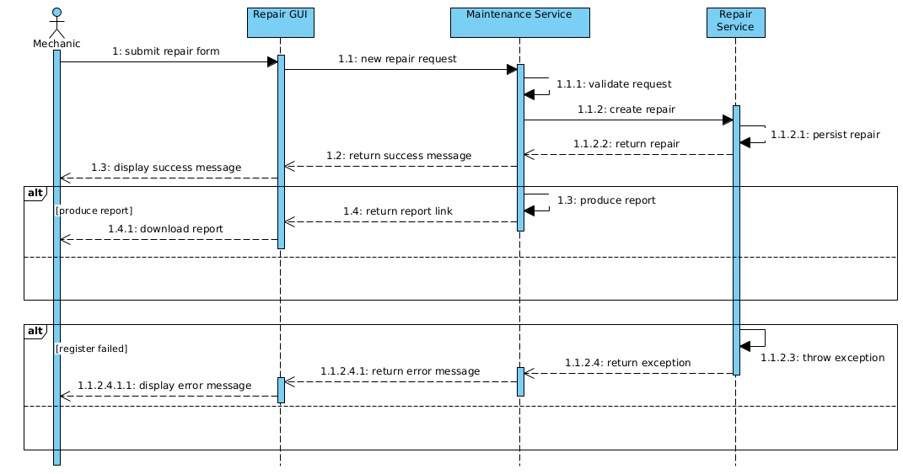

# Sujet
Système de gestion de la maintenance automobile et prototype d'un système d'aide au diagnostic automobile. [infos](https://github.com/rocdane/loga-project)

## Description
La maintenance automobile est un domaine du secteur de l’automobile qui a pour but de gérer les services d’entretien et de réparation des véhicules automobile. Les garagistes, acteurs de ce domaine, font face à certaines difficultés liés à la gestion des maintenances.

Tout garagiste souhaite la bonne gestion de ses affaires incluant la résolution des pannes qu’il a l’opportunité de rencontrer. Toutefois, la maintenance automobile requiert un haut niveau d’intelligence, parfois au dessus des capacités humaines pour résoudre ces derniers.

Dans le cadre du travail de fin d'étude pour l'obtention du diplôme de Master en informatique, nous apportons une solution dédiée à la bonne gestion des maintenances automobile. Le résultat que nous obtiendrons est un système d'informations de prise de décision capable d'assister les garagistes dans leur métier.


## Fonctionnalités

### Releases
1. Gestion informatisée des informations clients
2. Gestion informatisée des informations de maintenance
3. Service intelligent d'aide au diagnostic
4. Monitoring et reporting des informations de gestion

### Perspectives
5. Constitution d'un stock virtuel de pièces de rechanges
6. Service intelligent d'aide à la commande des pièces de rechanges
7. Gestion informatisée de l'approvisionnement en pièce de rechanges
8. Gestion informatisée des ressources humaines
9. Gestion informatisée des ressources matérielles
10. Gestion informatisée du flux financier
11. Elaboration du bilan comptable


## Conceptions architecturales
### Diagramme de séquence du service intelligent

### Diagramme de séquence du service de diagnostic

### Diagramme de séquence du service de réparation

### Diagramme de classe du service intelligent

### Diagramme de classe du service client

### Diagramme de classe du service de diagnostic

### Diagramme de classe du service de réparation

### Diagramme de composant

### Diagramme de déploiement


## Programmation
```json
{
  "environment":{
  	"OS":"Ubuntu-22.10",
  	"IDE":"Intellij-2023.1.3",
  	"JDK":"OpenJDK-19",
    "RDBMS":"Postgresql-15.3"
  },
  "code":{
  	"Langage":"Java",
    "Framework":{
      "openjfx":"18.0.1",
      "spring-boot":"3.0.6", 
      "spring-cloud":"2022.0.2"
    }
  },
  "build":{
  	"maven":"3.6.3",
  	"git":"2.41.0"
  },
  "test":{
  	"jenkins":"2.401.2"
  },
  "deployment":{
  	"docker":"24.0.2"
  }
}
```
## Résultats
### Ontologie d'application
#### Graphe de l'ontologie de diagnostic automobile

#### Individus de la classe Dysfonctionnement de l'ontologie

#### Individus de la classe Maintenance de l'ontologie

### Interfaces
#### Menu principal

#### Menu Atelier

#### Tableau de bord

#### Interface de gestion des automobiles

#### Interface de gestion des clients

#### Assistance de saisie des dysfonctionnements

#### Assistance de saisie des maintenances

#### Succès d'enregistrement du diagnostic

### Exemple de rapport de diagnostic


## Datas
### Datamarts de données clients

### Datamarts des données de diagnostic

### Datamarts des données de réparation

